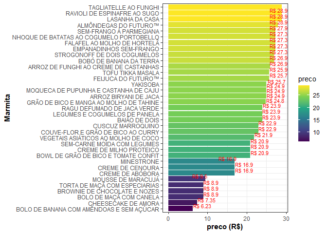

<!-- README.md is generated from README.Rmd. Please edit that file -->

# veganr

<!-- badges: start -->

 


[](https://www.tidyverse.org/lifecycle/#maturing)
[](https://github.com/jsjale/veganr/actions)
[](https://codecov.io/gh/jsjale/veganr?branch=master)
<!-- badges: end -->

O objetivo do veganr é disponibilizar as opções para compra de marmitas
veganas por meio da base de dados `marmitas_veganas` extraída do site do
[Beleaf](https://www.beleaf.com.br/cardapio-marmitas-veganas).

As opções de marmitas são:

-   Sopa: atualmente temos sopas das culinárias brasileira e italiana
    com indicadores nutricionais de pouco carbo e pouca caloria.

-   Prato: atualmente temos pratos das culinárias asiática, brasileira,
    funcional, indiana, italiana, mediterrânea e árabe com indicadores
    nutricionais do tipo apimentado, muita fibra, proteico, pouco carbo,
    pouca caloria e pouca gordura.

-   Doce: atualmente temos doces com indicadores nutricionais de zero
    acuacar e com acucar.

## Instalação

Você pode instalar a versão em desenvolvimento a partir do site
[GitHub](https://github.com/) com:

``` r
# install.packages("devtools")
devtools::install_github("jsjale/veganr")
```

## Exemplo

Este exemplo básico mostra como exibir no console a tibble mais atual
contendo as informações

``` r
library(veganr)
```

# Buscando a base de dados mais atual com `buscar_marmitas_veganas()`

``` r
head(buscar_marmitas_veganas())
#> # A tibble: 6 x 6
#>   item  nome                                descricao  preco tipo_refeicao url  
#>   <chr> <chr>                               <chr>      <dbl> <chr>         <chr>
#> 1 1     TAGLIATELLE AO FUNGHI               Tomatinho~  28.9 Prato         http~
#> 2 2     MACARONI COM CHEDDAR DE CASTANHAS   Farofa de~  28.9 Prato         http~
#> 3 3     RAVIOLI DE ESPINAFRE AO SUGO        Com casta~  28.9 Prato         http~
#> 4 4     YAKISOBA                            Shiitake,~  24.9 Prato         http~
#> 5 5     ARROZ BIRYANI DE JACA               Couve-flo~  24.9 Prato         http~
#> 6 6     VEGETAIS ASIÁTICOS AO MOLHO DE COCO Grão de b~  21.9 Prato         http~
```

É possível visualizar um gráfico de barras contendo as informações de
marmitas e preços do banco de dados `marmitas_veganas`, por exemplo:

``` r
bar_plot()
```



Para visualizar um gráfico de barras iterativo, basta executar a função
`bar_plotly()`. Outra opção iterativa pode ser obtida executando
`sun_plotly()`.
